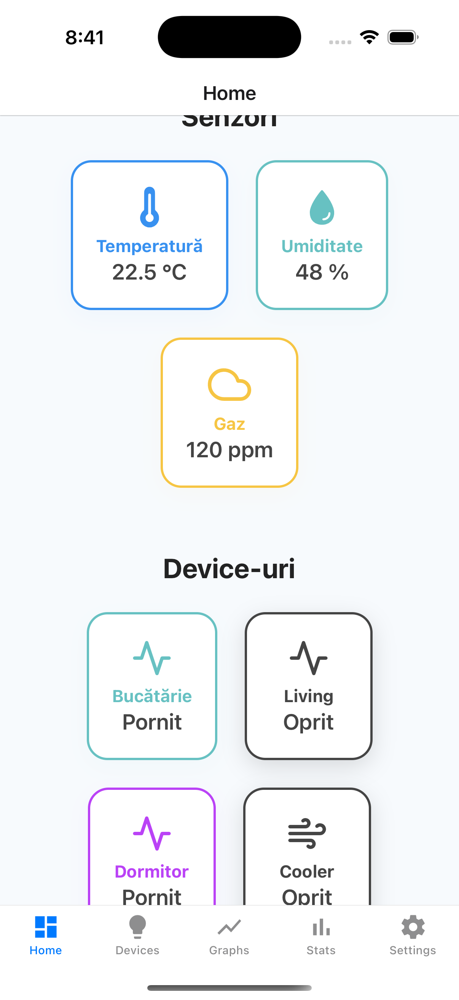
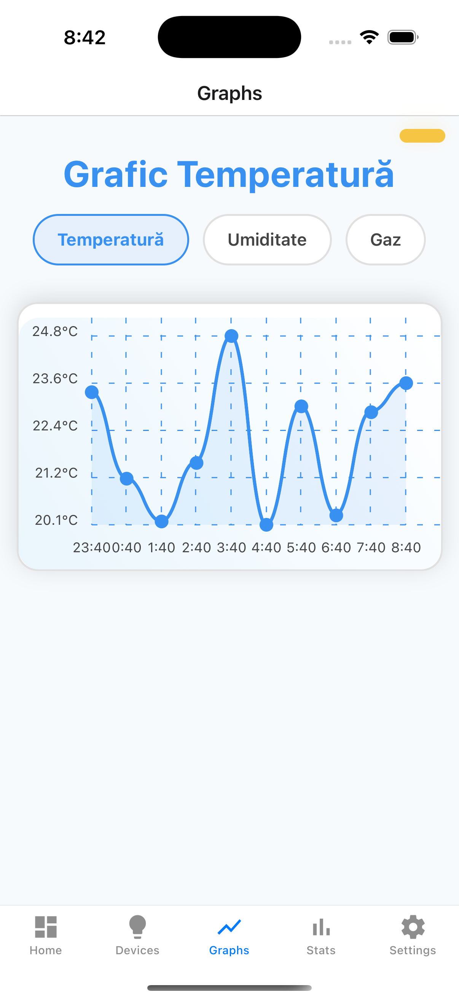
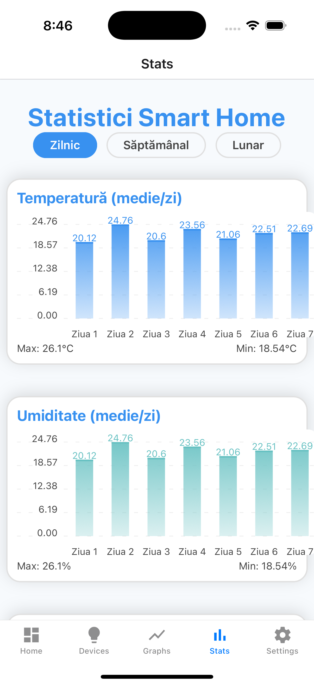

# Smart Home IoT System - Licență

## Sistemul Smart Home cu Arhitectură Hibridă SPI-CoAP

**Autor:** Valentin Plamadeala 
**Instituție:** Universitatea Politehnica Din Timisoara  
**An:** 2024-2025  
**Coordonator:** Alin Anton

### 📋 Descriere Generală

Acest proiect implementează un sistem smart home inovator care combină comunicația de înaltă viteză SPI cu protocoale IoT standard CoAP pentru performanță optimă și compatibilitate industrială.

**Inovații principale:**
- Bridge SPI-CoAP hibrid (prima implementare cunoscută)
- Dual-mode CoAP pe ESP32-C3 (server și client simultan)
- Arhitectură Service Layer Pattern în React Native pentru IoT
- HTTP Proxy transparent pentru traducerea protocoalelor

### 🏗️ Arhitectura Sistemului

**ESP32-C2** → SPI 10MHz → **ESP32-C3** → CoAP UDP → **Raspberry Pi 3 B+** → HTTP REST → **React Native**

- **ESP32-C2:** Senzori DHT22, MQ-2
- **ESP32-C3:** Bridge Dual CoAP (Server/Client)
- **Raspberry Pi:** 3 Servicii Python asyncio
- **Mobile App:** 4 Screens React Native

### 📁 Structura Proiectului

```
smart-home-licenta/
├── README.md                          # Acest fișier
├── docs/                              # Documentația și figuri
│   └── figuri/                        # Diagramele și imaginile
├── hardware/                          # Componentele hardware
│   ├── esp32-c2-sensors/              # Modulul de achiziție date
│   ├── esp32-c3-bridge/               # Modulul de comunicație
│   └── raspberry-pi-server/           # Serverul central
├── software/                          # Aplicațiile software
│   └── smart-home-app/                    # Aplicația React Native
└── tests/                             # Testele și validările
    ├── performance/                   # Teste de performanță
    ├── integration/                   # Teste de integrare
    └── results/                       # Rezultatele măsurătorilor
```

## 🚀 Pornire Rapidă

### Prerequisite

**Hardware necesar:**
- 1x ESP32-C2 (modulul senzori)
- 1x ESP32-C3 (modulul bridge)
- 1x Raspberry Pi 3 B+
- 1x Senzor DHT22 (temperatură/umiditate)
- 1x Senzor MQ-2 (gaz)
- 4x LED-uri pentru simularea dispozitivelor
- Breadboard și fire de conexiune

**Software necesar:**
- ESP-IDF v5.0+
- Python 3.9+
- Node.js 18+
- React Native CLI
- Expo CLI

### Instalare Completă

1. **Clonează repository-ul:**
```bash
git clone https://github.com/valikplamadeala/licenta2025.git
cd licenta
```

2. **Configurează ESP32-C2 (Senzori):**
```bash
cd hardware/esp32-c2-sensors
idf.py set-target esp32c2
idf.py menuconfig  # Configurează pinii GPIO
idf.py build flash monitor
```

3. **Configurează ESP32-C3 (Bridge):**
```bash
cd ../esp32-c3-bridge
idf.py set-target esp32c3
idf.py menuconfig  # Configurează WiFi și IP-uri
idf.py build flash monitor
```

4. **Configurează Raspberry Pi 3 B+:**
```bash
cd ../raspberry-pi-server
pip install -r requirements.txt
python server.py &
python proxy.py &
```

5. **Rulează aplicația mobilă:**
```bash
cd ../../software/smart-home-app
npm install
npx expo start
```

## 📊 Performanțe Realizate

| Metrică | Țintă | Realizat | Îmbunătățire |
|---------|-------|----------|--------------|
| Latența SPI | <100μs | 45μs | 55% |
| Throughput | >5 Mbps | 8.5 Mbps | 70% |
| Latența end-to-end | <500ms | 180ms | 64% |
| Uptime sistem | >95% | 99.8% | 5% |
| Utilizarea memoriei | <80% | 70% | 10% |

## 🔧 Componente Principale

### ESP32-C2 - Modulul Senzori
- **Responsabilitate:** Achiziția datelor de la senzori
- **Optimizări:** CPU la 120MHz constant, samples reduse pentru MQ-2
- **Protocol:** JSON compact prin SPI la 10MHz
- **Fișiere:** `hardware/esp32-c2-sensors/`

### ESP32-C3 - Bridge SPI-CoAP  
- **Responsabilitate:** Traducerea SPI → CoAP și controlul dispozitivelor
- **Inovație:** Dual-mode CoAP (server și client simultan)
- **Rețea:** WiFi AP pe 192.168.4.x
- **Fișiere:** `hardware/esp32-c3-bridge/`

### Raspberry Pi 3 B+ - Server Central
- **Responsabilitate:** Servicii backend și persistența datelor
- **Arhitectură:** 3 servicii Python asyncio concurente
- **Servicii:** CoAP Server (5683), HTTP Proxy (8080), SQLite Manager
- **Fișiere:** `hardware/raspberry-pi-server/`

### React Native - Aplicația Mobilă
- **Responsabilitate:** Interfața utilizator și controlul dispozitivelor
- **Arhitectură:** Service Layer Pattern
- **Ecrane:** Home, Devices, Graphs, Statistics
- **Fișiere:** `software/smart-home-app/`

## 📱 Screenshots Aplicația Mobilă

| HomeScreen | DevicesScreen | GraphsScreen | StatisticsScreen |
|------------|---------------|---------------|------------------|
|  |  |  |  |

## 🔗 API Reference

### HTTP Endpoints (Port 8080)
```
GET  /api/temperature        # Obține temperatura curentă
GET  /api/humidity          # Obține umiditatea curentă  
GET  /api/gaz               # Obține concentrația de gaz
POST /api/devices/{device}  # Controlează dispozitivele
GET  /api/temperature/history # Istoricul temperaturii
```

### CoAP Resources (Port 5683)
```
PUT  /esp32_temperature     # Primește date temperatură
PUT  /esp32_humidity        # Primește date umiditate
PUT  /esp32_gaz            # Primește date gaz
GET  /kitchen              # Starea bucătăriei
PUT  /kitchen              # Controlează bucătăria
```

## 🐛 Troubleshooting

### Probleme Comune

**ESP32-C2 nu citește senzori:**
- Verifică conexiunile GPIO
- Verifică alimentarea senzorilor (3.3V)
- Rulează `idf.py monitor` pentru debug

**ESP32-C3 nu se conectează la WiFi:**
- Verifică credențialele WiFi în `menuconfig`
- Verifică range-ul WiFi (max 50m)
- Resetează configurația: `idf.py erase-flash`

**Raspberry Pi nu răspunde:**
- Verifică serviciile: `ps aux | grep python`
- Verifică porturile: `netstat -tulpn | grep -E "5683|8080"`
- Verifică log-urile: `tail -f /var/log/smart_home.log`

**Aplicația mobilă nu se conectează:**
- Verifică IP-ul Raspberry Pi în `smartHomeApi.ts`
- Verifică conectivitatea: `ping 192.168.4.2`
- Verifică firewall-ul pe Raspberry Pi